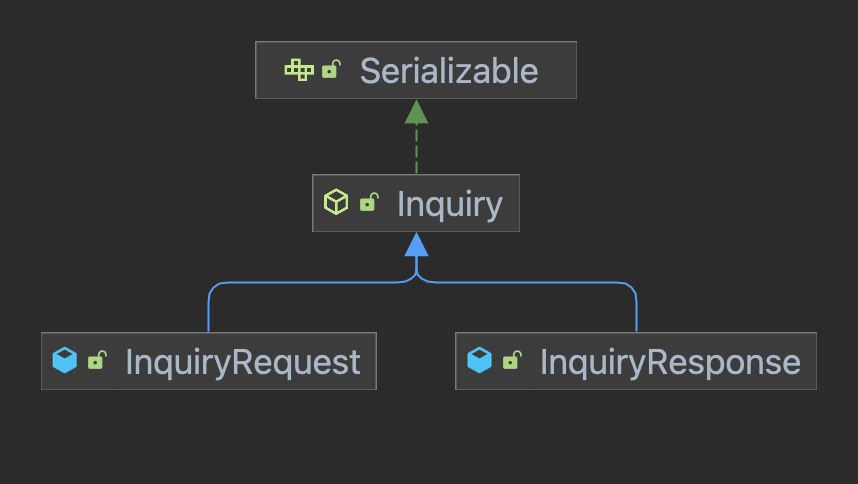
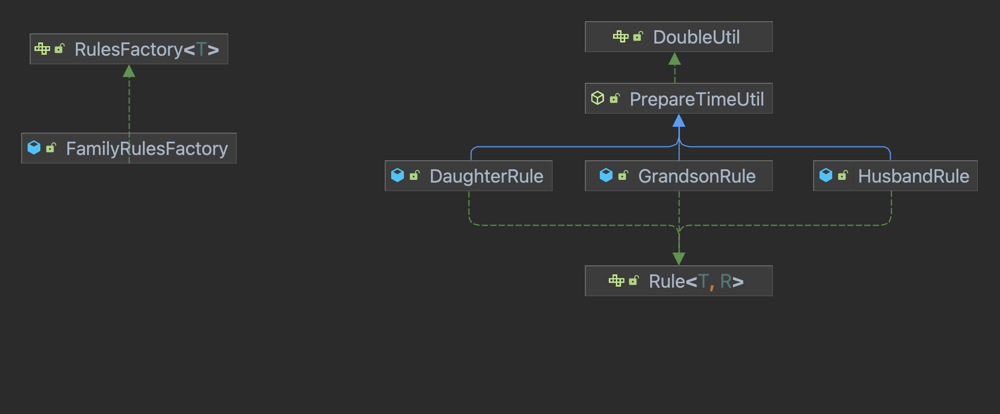
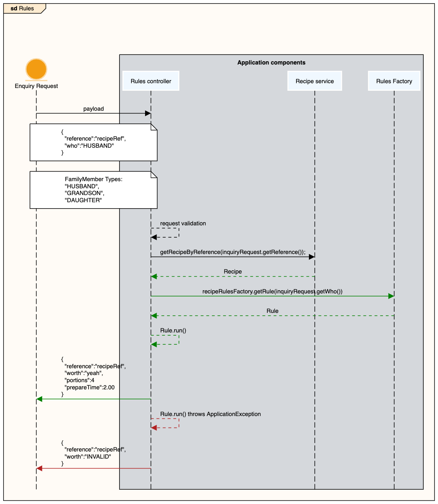

[Back](../README.md)

# Recipe book application rules
This module contains all objects regarding the `It is worth rules` (simple business rules) managed by the application

## Motivation
This module needs to implement a logic to apply some `family business rules` depending on the values of the payload provided, following the below logic:

- Tell to the consumer if it's worth the time spent and additional information for the specific payload `reference` and the family user `who` submitted.
- All family members will use the same enquiry format
- Each family member will have different logic rule
- Each family member will expect different responses depending on the rule logic implemented for each specific family member

**payload example**
```json
{
  "reference": "A-RECIPE-REFERENCE",
  "who": "FAMILY-MEMBER-TYPE"
}
```
```json
{
  "reference": "Husband-12345A",
  "who": "HUSBAND"
}
```

### Husband rules

| Recipe (json part)                                                                                  | field        | condition  | payload                                               | calculation             | response                                                             |
|-----------------------------------------------------------------------------------------------------|--------------|------------|-------------------------------------------------------|-------------------------|----------------------------------------------------------------------|
| `{"reference":"Husband-12345A","portions":10,"prepare_time":1.10,"members":[{"member":"HUSBAND"}]}` | prepare_time | < 2.00 (h) | `{"reference": "Husband-12345A","who": "HUSBAND"}`    |                         | `{"reference": "Husband-12345A","worth": "yeah","prepareTime": 1.1}` |
| `{"reference":"Husband-22345A","portions":2,"prepare_time":2.00,"members":[{"member":"HUSBAND"}]}`  | prepare_time | = 2.00 (h) | `{"reference": "Husband-22345A","who": "HUSBAND"}`    | prepare_time + 10 (min) | `{"reference": "Husband-22345A","worth": "meh","prepareTime": 2.17}` |
| `{"reference":"Husband-32345A","portions":4,"prepare_time":3.00,"members":[{"member":"HUSBAND"}]}`  | prepare_time | > 2.00 (h) | `{"reference": "Husband-32345A","who": "HUSBAND"}`    |                         | `{"reference": "Husband-32345A","worth": "nah"}`                     |
| `{"reference":"Husband-32345A","portions":4,"prepare_time":3.00,"members":[{"member":"HUSBAND"}]}`  | prepare_time | > 2.00 (h) | `{"reference": "unknown-reference","who": "HUSBAND"}` |                         | `{"reference":"unknown-reference","worth":"INVALID"}`                |

### Grandson rules

| Recipe (json part)                                                                                    | field        | condition  | payload                                                | calculation             | response                                                                          |
|-------------------------------------------------------------------------------------------------------|--------------|------------|--------------------------------------------------------|-------------------------|-----------------------------------------------------------------------------------|
| `{"reference":"Grandson-12345A","portions":20,"prepare_time":1.20,"members":[{"member":"GRANDSON"}]}` | prepare_time | < 2.00 (h) | `{"reference": "Grandson-12345A","who": "GRANDSON"}`   | prepare_time - 15 (min) | `{"reference":"Grandson-12345A","worth":"yeah","portions":20,"prepareTime":0.95}` |
| `{"reference":"Grandson-22345A","portions":4,"prepare_time":2.00,"members":[{"member":"GRANDSON"}]}`  | prepare_time | = 2.00 (h) | `{"reference": "Grandson-22345A","who": "GRANDSON"}`   | prepare_time - 10 (min) | `{"reference":"Grandson-22345A","worth":"yeah","portions":4,"prepareTime":1.83}`  |
| `{"reference":"Grandson-32345A","portions":4,"prepare_time":3.00,"members":[{"member":"GRANDSON"}]}`  | prepare_time | > 2.00 (h) | `{"reference": "Grandson-32345A","who": "GRANDSON"}`   | prepare_time - 5 (min)  | `{"reference":"Grandson-32345A","worth":"yeah","prepareTime":2.92}`               |
| `{"reference":"Grandson-32345A","portions":4,"prepare_time":3.00,"members":[{"member":"GRANDSON"}]}`  | prepare_time | > 2.00 (h) | `{"reference": "unknown-reference","who": "GRANDSON"}` | prepare_time - 5 (min)  | `{"reference":"unknown-reference","worth":"INVALID"}`                             |


### Daughter rules

| Recipe (json part)                                                                                    | field        | condition  | payload                                                | calculation             | response                                                                          |
|-------------------------------------------------------------------------------------------------------|--------------|------------|--------------------------------------------------------|-------------------------|-----------------------------------------------------------------------------------|
| `{"reference":"Daughter-12345A","portions":30,"prepare_time":1.30,"members":[{"member":"DAUGHTER"}]}` | prepare_time | < 2.00 (h) | `{"reference": "Daughter-12345A","who": "DAUGHTER"}`   | prepare_time - 15 (min) | `{"reference":"Daughter-12345A","worth":"yeah","portions":30,"prepareTime":1.05}` |
| `{"reference":"Daughter-22345A","portions":6,"prepare_time":2.00,"members":[{"member":"DAUGHTER"}]}`  | prepare_time | = 2.00 (h) | `{"reference": "Daughter-22345A","who": "DAUGHTER"}`   | prepare_time - 10 (min) | `{"reference":"Daughter-22345A","worth":"yeah","portions":6,"prepareTime":1.83}`  |
| `{"reference":"Daughter-32345A","portions":4,"prepare_time":3.00,"members":[{"member":"DAUGHTER"}]}`  | prepare_time | > 2.00 (h) | `{"reference": "Daughter-32345A","who": "DAUGHTER"}`   |                         | `{"reference":"Daughter-32345A","worth":"meh","prepareTime":3.0}`                 |
| `{"reference":"Daughter-32345A","portions":4,"prepare_time":3.00,"members":[{"member":"DAUGHTER"}]}`  | prepare_time | > 2.00 (h) | `{"reference": "unknown-reference","who": "DAUGHTER"}` |                         | `{"reference":"unknown-reference","worth":"INVALID"}`                             |


## How it works

The Rules flow:

1.The application validates the request payload and deserialize it into `InquiryRequest` object.



```json
{
  "reference": "Daughter-32345A",
  "who": "DAUGHTER"
}
```
2.Retrieve the `Recipe` object by `reference` stored in the database
3.If a recipe not found return an ApplicationException
4.Check if the member provided in the `who` field matches a `member` in the `Recipe`
5.If the `who` matches a `member` run the Rule instance for that `member` and builds the response object `InquiryResponse`.

**Classes diagram**



**Rules logic diagram**



## Rules defined

- Husband rules
- Grandson rules
- Daughter rules


## Endpoint

- `https://localhost:${server.port}/rules`
- Example: http://localhost:8080/rules
- 
## Example payloads

**Husband**
```json
{
  "reference": "12345A",
  "who": "HUSBAND"
}
```
**Grandson**
```json
{
  "reference": "12345A",
  "who": "GRANDSON"
}
```
**Daughter**
```json
{
  "reference": "12345A",
  "who": "DAUGHTER"
}
```

## Add new member rules
Add a new member rule is an easy:

- Add the new member type on `FamilyMemberType` to typify the new member (you will find it in data model module)
- Create a new member rule class that implements `Rule` interface
  - Add the logic implementation in `run` method
  - Add the logic implementation to build the response.
  - Add the member type to identify the rule family type instance using the `FamilyRulesFactory`
  - Register you new family rule on `ApplicationGuiceModule` in the `recipe-book-application-server`


[Back](../README.md)